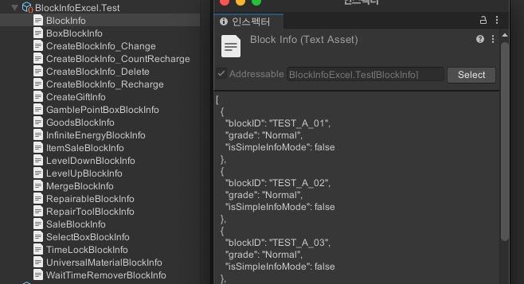

## 개발 기간

- 2022.04 ~ 2022.09 : 프로그래밍 파트는 혼자 진행. 대부분의 게임 기반 시스템 설계
	- 게임 기반 시스템 
	- 인게임 
	- 아웃게임 월드
- 2022.10 ~ 2022.11 : 추가 인원 투입 (클라이언트 + 1, 서버 + 1)
	- 서버 연동
	- 광고 추가
- 2022.11 소프트 런칭
- ~ 2023.05
	- 다국어 처리
	- 네오위즈 플렛폼 플러그인 추가
	- 각종 이벤트 및 기능 개선
- 2023.06 ~ 정식 런칭 후 현재 까지 라이브 서비스 진행중

---

## 사용한 유니티 기능

- SRP-URP2D
- 어드레서블에셋
- New Input System
- TextMeshPro
- UGUI
- Timeline (아웃게임 퀘스트 리시브 및 클리어 연출에 사용)
- Cinemachine (아웃게임 카메라 컨트롤에 사용)

---

## 인게임

### 블록 및 보드

- 다양한 기능을 가진 **블록 시스템 구현**.
- **같은 블록을 합치면 다음 단계의 블록 생성**.
- 다양한 블록을 요구하는 미션을 클리어 하기 위해 머지를 통해 미션에서 요구하는 블록을 만들고 제출하며 게임을 진행

### 시스템 구조

#### 인게임

- Grid : 인게임 보드 입니다. (View)
- Map : 인게임 보드의 데이터를 관리 합니다. (Model)
- Inspector : 블록의 정보를 표시 합니다.
- QuestWindow : 진행중인 퀘스트를 표시 합니다.
- RewardBox : 보상이 순차적으로 쌓이는 상자 입니다.
- BlockInfoManager : 블록 정보를 관리 합니다.
- QuestManager : 퀘스트 정보를 관리 합니다.
- BlockFactory : BlockInfoManager에서 블록 정보를 가져와 블록 오브젝트를 만듭니다.

#### 블록 시스템

블록 시스템은 **BlockComponent 기반의 모듈형 설계**를 적용했습니다.

- 각 블록은 **여러 개의 BlockComponent**로 구성됨.
	- 예: 상자A 블록 = (시간 경과 후 다른 블록으로 변경) + (동일 블록 2개 합치기) + (블록 판매 가능)
- 블록은 여러 액션들을 가지고 있고 상황에 따라 액션을 가진 컴포넌트를 호출
	- 예: 블록 선택, 블록 이동, 블록 포커스 등
- **BlockComponent는 필요한 액션을 구현** 하여 동작 합니다.

이러한 방식 덕분에 신규 기능 추가 시 **기존 코드를 수정할 필요 없이** 확장 방식으로 개발할 수 있습니다.

---

## 아웃게임

### 퀘스트 시스템

- **챕터 → 퀘스트 → 미션** 구조로 설계.
	- 모든 미션을 클리어 하면 퀘스트를 클리어 할 수 있고, 퀘스트를 모두 클리어 하면 챕터를 클리어 할 수 있음
- **각 요소의 진행 상태를 히스토리 형태로 기록**. (이 기록으로 아웃에임의 월드를 구성)

### 아웃게임 월드

- **퀘스트 진행도에 따라 월드의 모습이 점진적으로 변화**.
- 스크린샷은 챕터 1 -> 챕터 13 까지의 변화.

### 다이얼로그 시스템

캐릭터 간 대화를 위한 **다이얼로그 시스템**을 구현했습니다.

- **캐릭터 간 대화 시스템 구현**.
- **엑셀 기반 데이터 입력 → 자동 변환 → 어드레서블 키를 통해 호출 후 자동 재생**.
- 다양한 연출 기능 구현 (배경 변환, 캐릭터 위치 이동, 특정 시점에 사운드 재생 등)

### 퀘스트 연출 시스템

- **Unity Timeline을 활용하여 퀘스트 리시브 및 클리어 연출 제작**.
- 프로젝트에 필요한 **커스텀 트랙** 을 추가하면서 진행 (연출 도중 다이얼로그 처리, Spine 오브젝트 관리 등).

---

## 각종 컨텐츠 개발

### 블록 생성 / 교환기

- **아웃게임 오브젝트에 부착되는 기능**.
- 시간이 지나면 특정 블록을 받거나, 재료 블록을 제공하여 교환하는 기능 구현.

### 캐릭터 스토리

- 각 캐릭터의 **사이드 스토리를 진행할 수 있는 전용 콘텐츠**.
- **인게임 보드와 별개로 진행되는 전용 보드 구성**.
- **전용 블록 및 미션 추가** → 기존 시스템을 활용하여 데이터 기반으로 구현.

### 스토리 다시보기

- 퀘스트 리시브/클리어 시 **Timeline 연출을 다시 볼 수 있는 기능 추가**.
- 기존에는 연출을 한 번 보면 다시 확인 불가 → **월드를 재구성 후 특정 Timeline을 재생할 수 있도록 개선**.

---

## 개발 도구 제작

### 엑셀 임포터

엑셀에서 작성한 데이터를 JSON 형태로 변환하여 **TextAsset**으로 자동 변환하는 시스템을 구현했습니다.

- 일반적으로 **시트명에 해당하는 클래스** 의 배열 형태로 변환되며, 파싱을 할 수 있습니다.
- 특정 데이터 형식에 따라서는 Json 변환 방식을 커스텀할 수 있도록 설계했습니다.

#### 사용 예시

- 엑셀에서 데이터를 입력 합니다.

- 엑셀 파일을 유니티 프로젝트에 저장합니다.

- 자동으로 TextAsset 형태로 변환됩니다.
 

### 보드 제작 툴

![[ingame_grid_tool.mp4]]

- **초기 보드 데이터를 제작할 수 있는 툴 개발**.
- **유니티 에디터 모드에서 직접 수정 가능**, 보드 데이터를 **JSON 형태로 저장 및 불러오기 가능**.
- **캐릭터 스토리의 각 스테이지별 보드 제작에도 활용**.

### 아웃게임 월드 구성 및 연출 확인 툴

- 연출 작업자가 **아웃게임을 쉽게 구성하고 연출을 바로 확인할 수 있도록 툴 제작**.
- 원하는 타임라인 바로 재생 기능
- 타임라인이 재생하기 위해 필요한 월드상태로 자동 세팅해주는 기능
- 현재 작업중인 타임라인의 위치를 포커싱해주는 기능

---

## 정리

- 이 프로젝트에서는 **유니티 엔진의 다양한 기능을 적극 활용**하여 개발 생산성을 높이려 했습니다.
- **인게임** : 모듈형 블록 시스템을 도입해 **유지보수성과 확장성을 강화**했습니다.
- **아웃게임** : 퀘스트 진행도에 따른 **월드 변화**, **다이얼로그 시스템**, **Timeline을 활용한 연출**을 구현했습니다.
- **데이터 관리** : 엑셀 임포터를 통해 **데이터 변환 및 관리 프로세스를 자동화**하여 효율성을 높였습니다.
