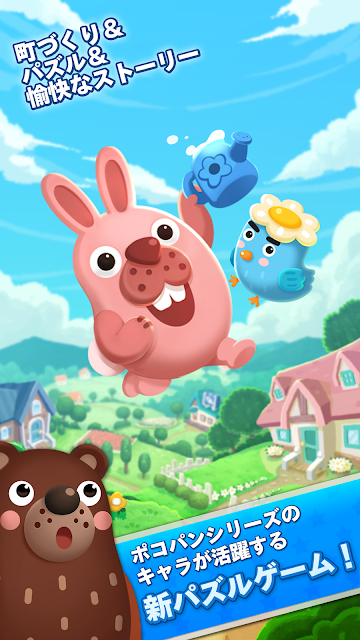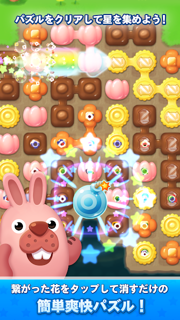

## 개발 기간

- 2018.06 ~ 2022.02 (클라이언트 - 3년 / 서버 - 6개월)

---

## 게임 컨텐츠 제작 (클라이언트 파트)

### 아웃게임 컨텐츠 제작

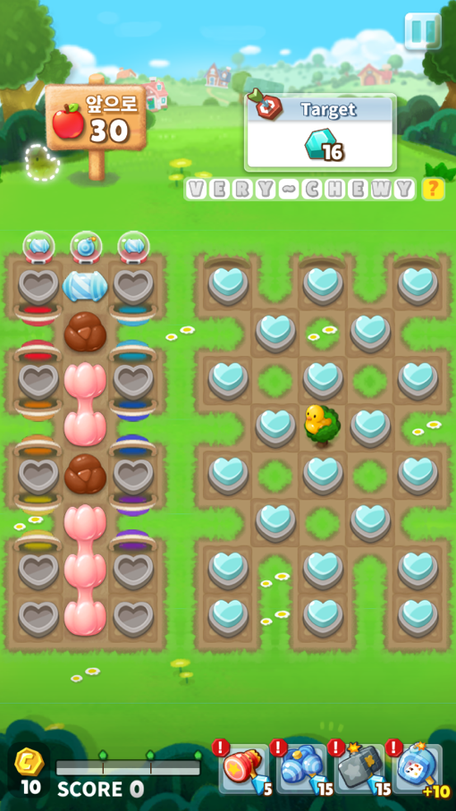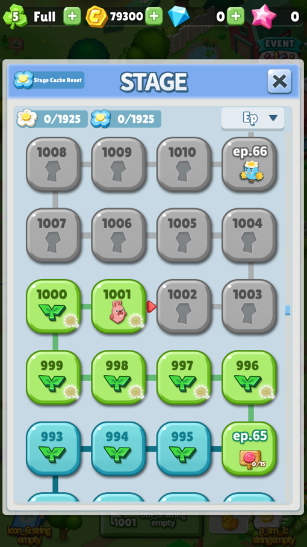

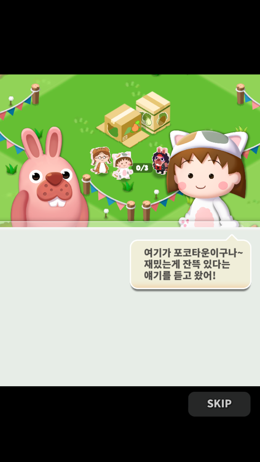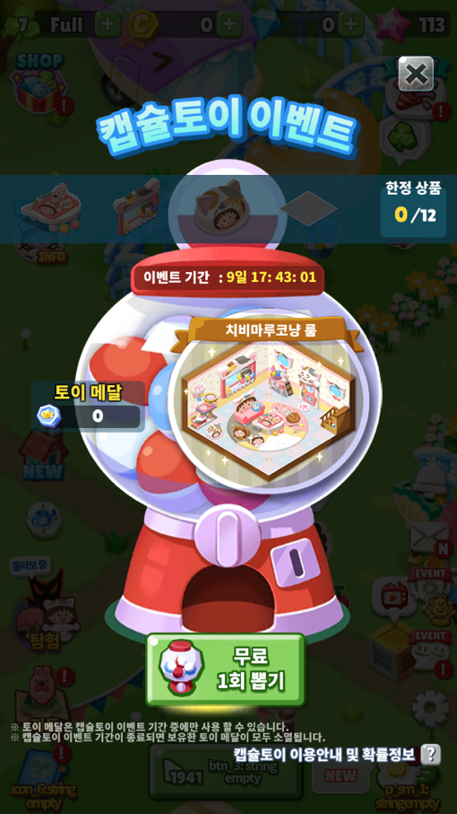

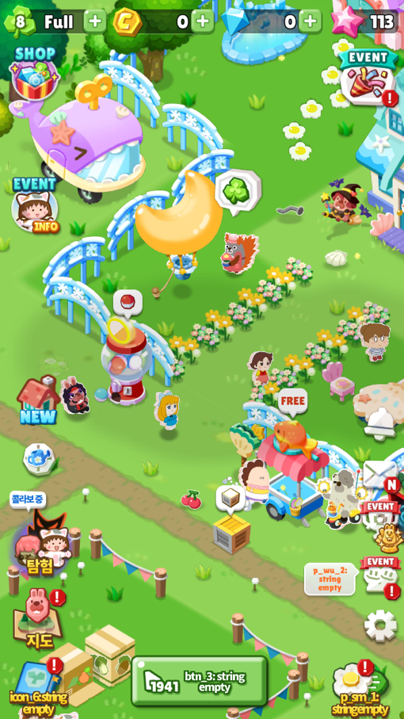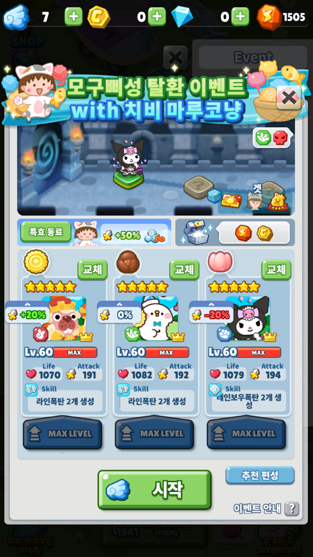

- **알폰스 상점 개선**: 재료 교환 기능, 무료 상자 및 폭탄 상자 추가.
- **인게임 스테이지 리스트 개편**: UI 및 UX 개선.
- **로딩 개선**: 연출 방식 변경 및 팁 제공 기능 추가.
- **월드 랭킹 시스템 추가**: 글로벌 랭킹 경쟁 요소 도입.
- **포코 친구 기능 추가**: 소셜 요소 강화.
- **Notice UI 개편**: 공지 시스템 개선 및 가독성 향상.
- **재화 UI 통합**: 게임 내 재화 관리 UI 일원화.
- **이벤트 / 패키지 UI 개편**: 사용자 경험을 개선하는 방향으로 UI 업데이트.
- **하우징 세트 정보 관리 툴 제작**: 하우징 관련 데이터를 보다 쉽게 관리할 수 있도록 툴을 개발.

### 인게임 컨텐츠 제작

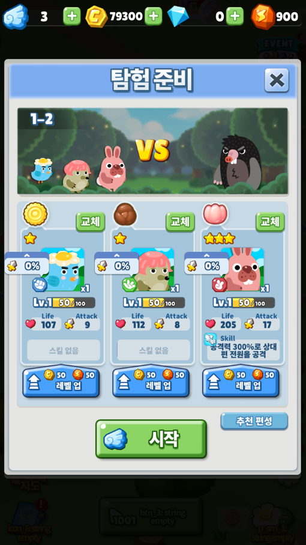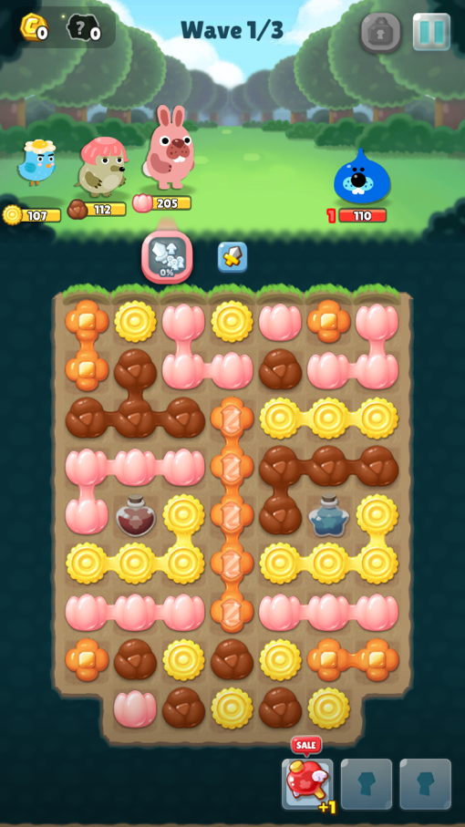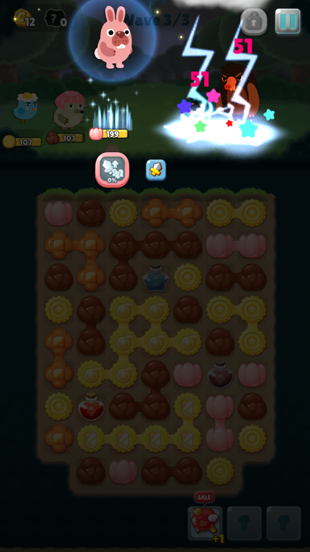

일반적인 게임 플레이와는 별도로 **"탐험 모드"** 라는 콘텐츠가 존재하며, **인게임 + 캐릭터 기반 스테이지 공략을 핵심 컨셉으로 하는 게임 모드** 입니다.

- **탐험 모드 시스템 전반 개발**.
- **프리미엄 및 마일리지 가챠 추가**.
- **속성 시스템 추가**: 캐릭터 및 몬스터 간 상성 도입.
- **탐험 모드 캐릭터 및 몬스터 스킬 시스템 개발**.
- **탐험 모드 이벤트 스테이지 추가**.
- **탐험 모드 배속 기능 도입**: 플레이 속도 조절 기능 추가.
- **캐릭터 최대 중첩 시스템 추가**: 동일 캐릭터 중첩 관련 로직 구현.
- **외형 변환 시스템 추가**: 캐릭터 스킨 및 변신 기능 구현.
- **탐험 모드 가챠 UI 및 UX 개선**: 랜딩 페이지 개편 및 사용자 경험 향상.

---

## 게임 개발에 필요한 도구 개발

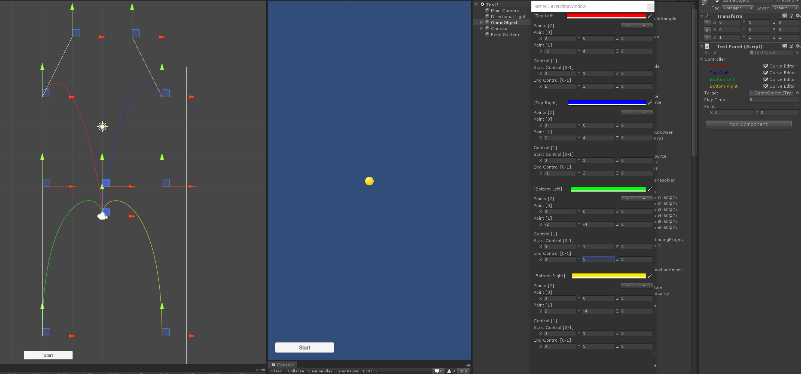

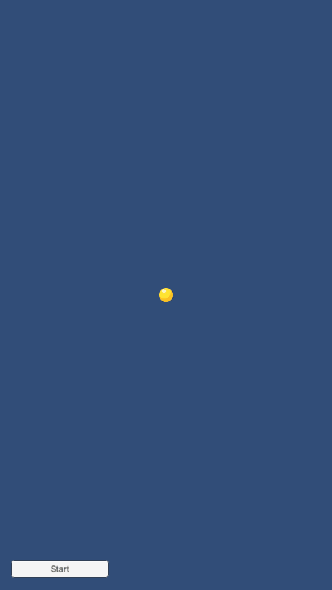

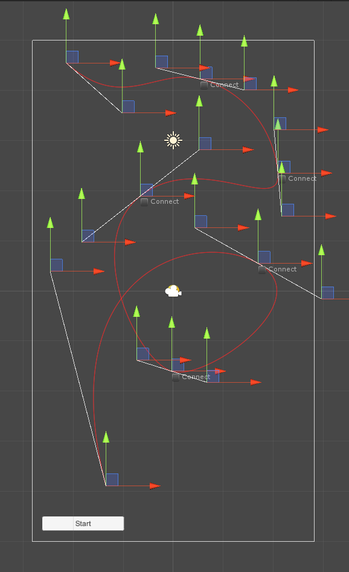

### 베지어 커브 툴 개발

#### 1. 개발 배경

게임 내 **클로버 사용 시, 특정 연출 효과**가 필요했습니다.

- 기존 연출 방식: 클로버가 **돼지 꼬리 형태로 한 바퀴 회전한 후, 특정 버튼으로 이동**.
- 문제점: 콘텐츠가 추가되면서 **이 연출을 동적으로 제어하고 싶다는 요청**이 들어옴.
- 해결책: **베지어 커브(Bezier Curve)를 동적으로 생성 및 제어**하여 다양한 연출에 활용할 수 있는 기능을 개발.

#### 2. 베지어 커브(Bezier Curve) 개선 및 적용

- **균일한 속도로 움직이는 베지어 커브 구현**
    
    - 기본적으로 Bezier Curve는 `t` 값을 조정할 때 **이동 속도가 일정하지 않은 문제**가 있음.
    - 이를 해결하기 위해 **곡선을 샘플링하여 일정한 속도로 움직이는 방식**을 적용.
    - 추가적으로, **곡선의 전체 거리를 계산**할 수 있도록 개선하여, 정밀한 연출이 가능해짐.
      
- **동적 커브 블렌딩 시스템 구현**
    
    - 좌상, 우상, 좌하, 우하 **4가지 기본적인 베지어 커브를 정의**.
    - 이를 **블렌딩하여 다양한 형태의 동적 커브를 생성**할 수 있도록 기능 확장.

#### 3. 활용 및 효과

- **연출 시스템 개선**: 다양한 UI 및 이펙트 연출에 활용.
- **인게임 기믹 적용**: 특정 오브젝트의 움직임이나 패턴을 보다 자연스럽고 유동적으로 제어.
- **컨텐츠 확장성 증가**: 기존의 정적인 연출 방식에서 벗어나, **동적으로 조정 가능한 애니메이션 시스템 구축**.

이번 **베지어 커브 툴을 통해 연출 및 기믹의 유연성이 대폭 향상**되었으며, 보다 자연스럽고 세밀한 움직임을 구현할 수 있었습니다.

### TileMap의 RuleTile 을 이용한 구름 및 블라인드 시스템

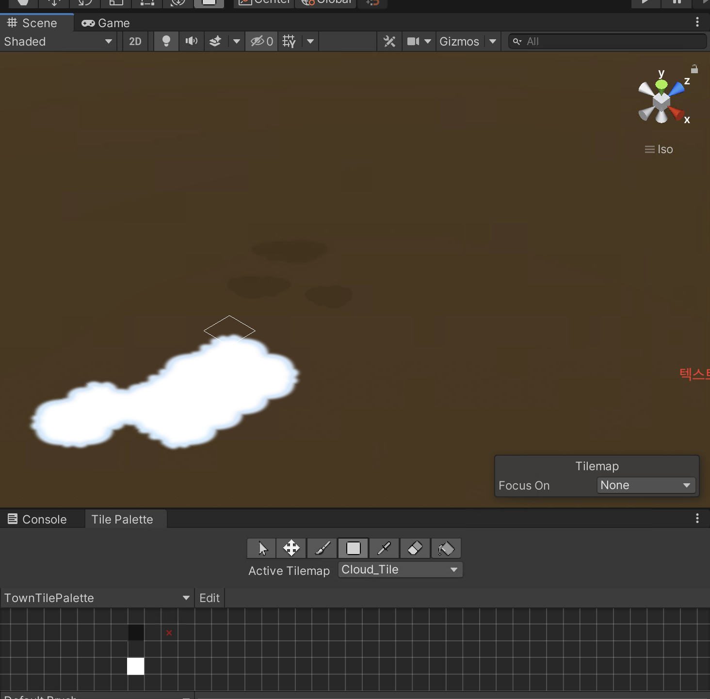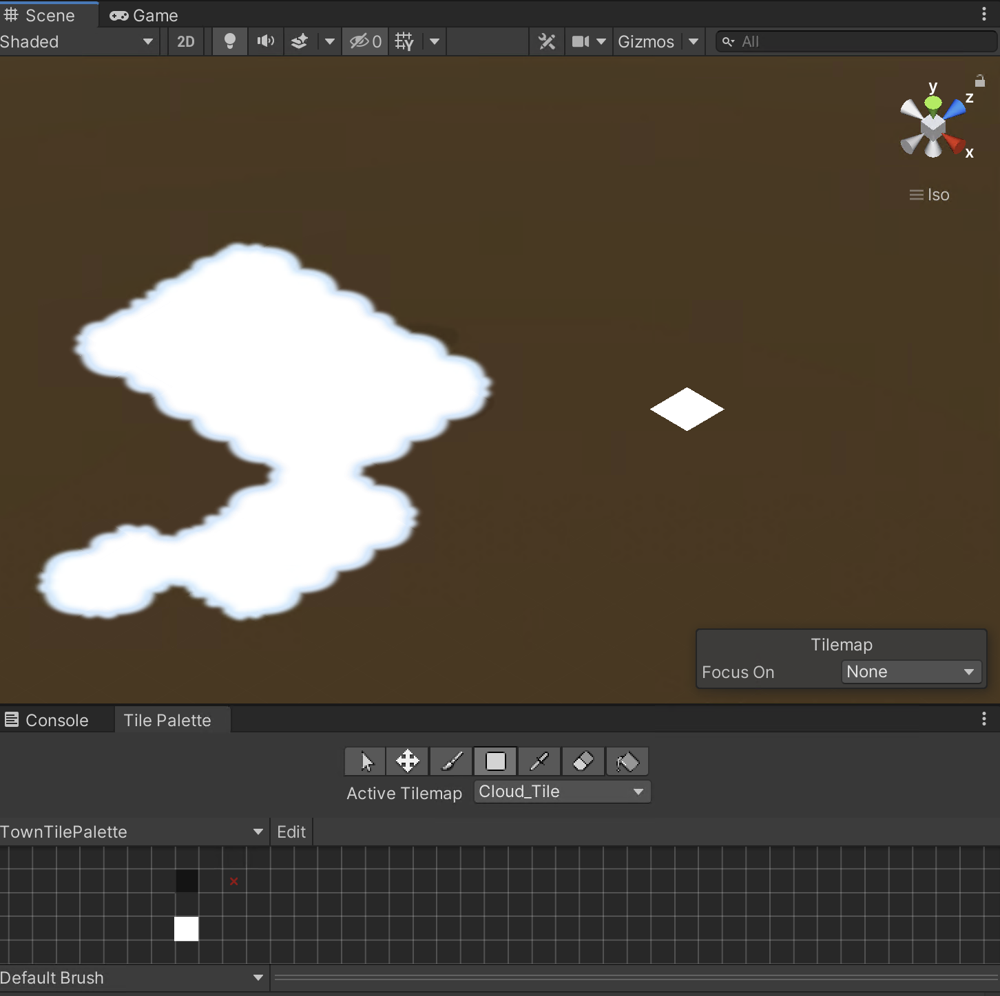

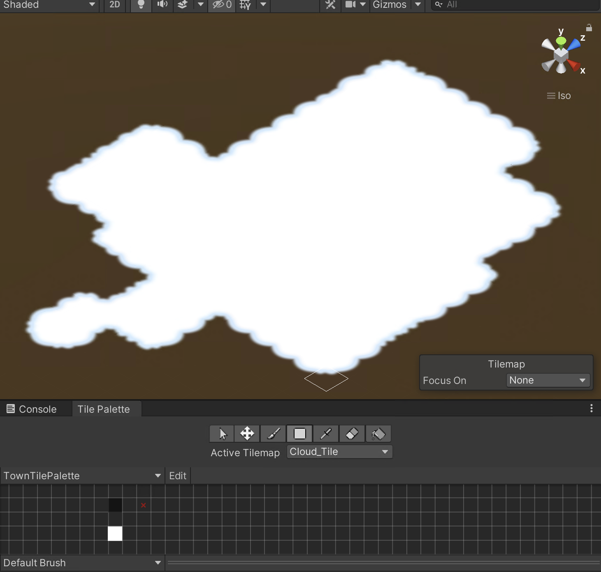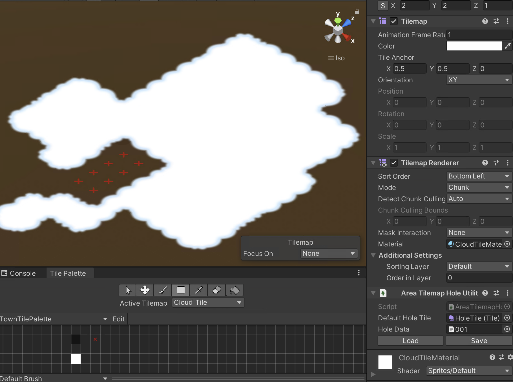

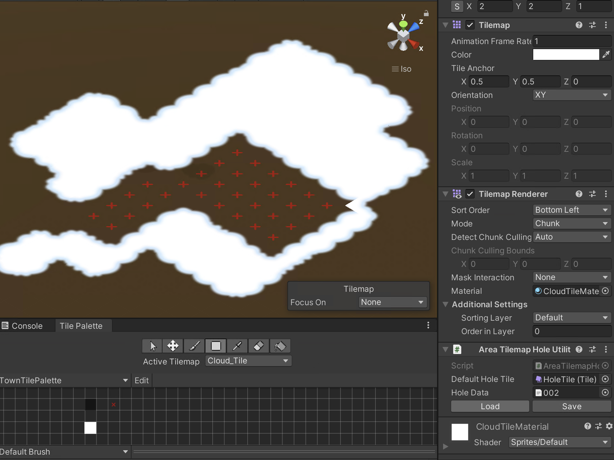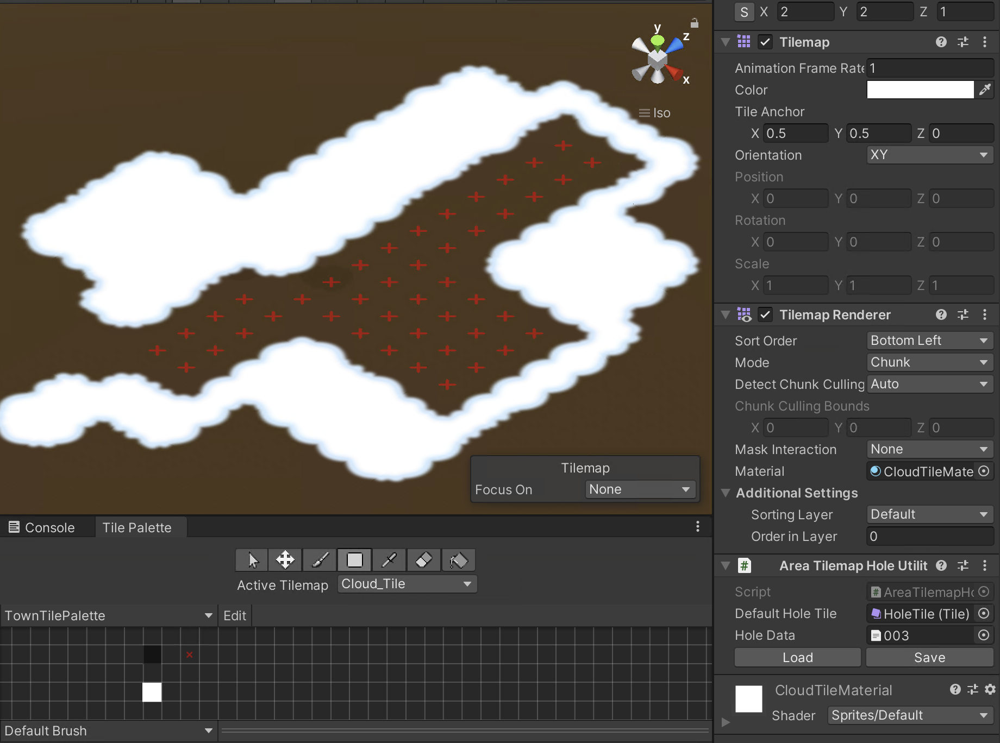

#### 1. 기존 시스템의 문제점

- 기존에 자체 제작된 **블라인드 시스템**이 존재했지만, **사용성이 떨어지고 리소스를 교체할 수 없는 한계**가 있었습니다.
- 연출 측면에서도 **블라인드 효과를 개선해 달라는 요청이 지속적으로 발생**하여, 보다 유연한 방식으로 개선이 필요했습니다.

#### 2. Unity TileMap & RuleTile을 활용한 개선

이 문제를 해결하기 위해 **Unity의 TileMap 시스템과 RuleTile을 활용하여 구름 및 블라인드 시스템을 새롭게 구축**했습니다.

- **TileMap 기반 시스템 적용**
    
    - RuleTile을 활용하여 **자동으로 패턴을 조정할 수 있도록 구현**.
    - 블라인드와 구름의 형태가 동적으로 변화하며 **보다 자연스러운 연출 가능**.
      
- **구름 및 블라인드의 확장 기능 추가**
    
    - 미션 진행도에 따라 **블라인드가 점차 해제되는 방식으로 개선**.
    - 이를 위해 **Hole 데이터를 생성하여 Json 파일로 저장 및 관리**.
    - **미션 진행 시 해당 Hole 데이터를 로드하여 점진적으로 지역이 표시되도록 설계**.

#### 3. 작업 편의성을 위한 툴 개발

- **GUI 기반 데이터 편집 툴 추가**
	
    - 작업자가 **Hole 데이터를 직관적으로 수정, 편집, 저장, 로드할 수 있도록 GUI 툴을 제작**.
    - 데이터 작업이 간편해지고, **비개발자도 쉽게 블라인드 및 구름 효과를 조정 가능**.

### TextMeshProToTexture

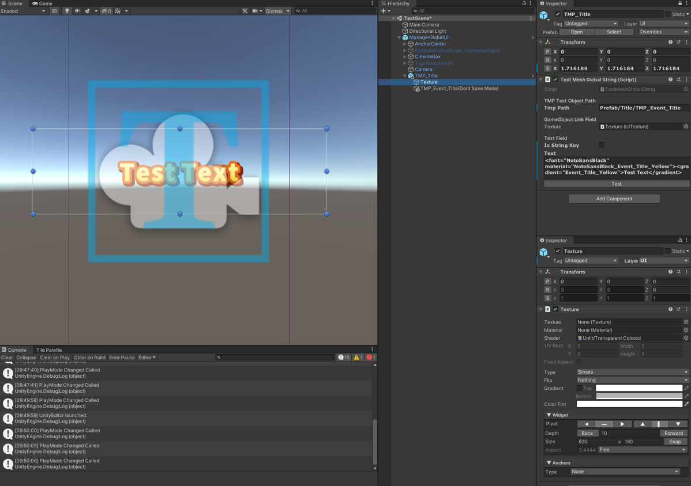

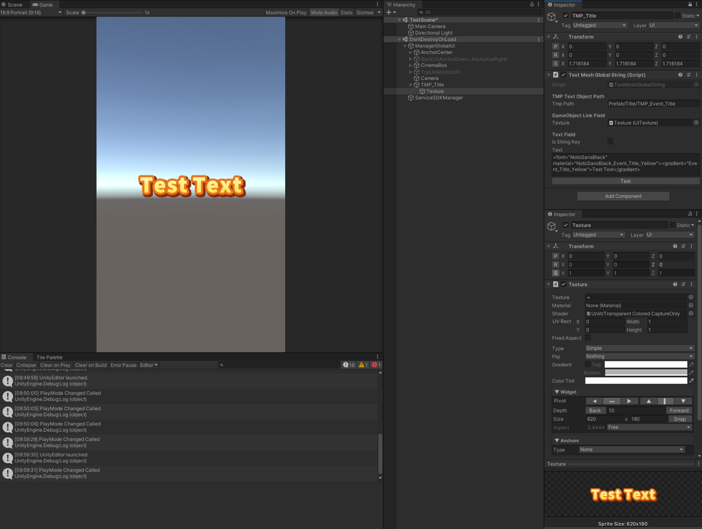

#### 1. 기존 문제점

- 기존 **NGUI 시스템 내부에서 뎁스(Depth) 관리 문제**로 인해 **TextMeshPro를 사용할 수 없었던 상황**.
- 텍스트를 꾸며야 하는 부분은 모두 **이미지로 처리**했으나, **대만 서비스 확정 후 이미지 관리의 어려움이 발생**.
    - 번역 이슈로 인해 텍스트가 자주 변경되면서 **이미지 수정 비용 증가**.
    - 리소스 용량 증가로 인한 관리 부담.

#### 2. 해결 방법: TextMeshPro → Texture 변환

이를 해결하기 위해 **TextMeshPro의 텍스트를 RenderTexture에 캡처한 후, Texture로 변환하여 사용**하는 방식으로 개선했습니다.

### **개발 방식**

- **TextMeshPro를 활용하여 텍스트 생성**.
- 해당 텍스트를 **RenderTexture로 렌더링한 후, Texture로 변환**.
- 변환된 Texture를 NGUI에서 사용하여 **뎁스 문제를 해결**.
- **런타임 최적화**:
    - **TextureMeshPro 오브젝트를 초기 세팅**한 후,
    - 런타임에 들어가면 **해당 오브젝트는 삭제되고 Texture만 남도록 처리**하여 불필요한 오브젝트를 줄임.

---

## 개발 플로우 개선

### 디바이스 전용 기능의 디버깅 환경 구축

일부 플러그인(랭킹, 친구 기능 등)은 에디터에서 테스트할 수 없고, 실제 디바이스에서만 확인이 가능했습니다. 이로 인해 기능 구현이나 문제 발생 시, 로그를 추가하고 빌드를 반복하는 비효율적인 방식으로 확인해야 했습니다.  
이를 개선하기 위해 iOS 및 Android 디바이스에서 직접 디버깅할 수 있는 환경을 구축하여, 개발 및 테스트 과정을 보다 원활하게 만들었습니다.

### 리소스 다운로드 시스템 개선

CDN을 통해 이미지를 다운로드하는 모듈이 있었지만, 다음과 같은 문제점이 있었습니다.

- **불필요한 다운로드**: 이미지 변경이 없어도 매번 다운로드가 발생.
- **확장성 부족**: 이미지 외의 다른 리소스를 다운로드할 수 없음.
- **메모리 관리 문제**: 다운로드한 리소스가 적절히 해제되지 않아 메모리 누수 발생.

이를 해결하기 위해 **새로운 리소스 매니저 시스템**을 개발했습니다.

- 리소스의 저장 위치나 형태에 관계없이 일관된 방식으로 관리 가능.
- 사용하지 않는 리소스를 자동으로 메모리에서 해제하여 누수를 방지.
- 외부에서 다운로드가 필요한 리소스는 캐시와 비교하여 변경이 있을 때만 다운로드하도록 처리.

### 이벤트 스테이지 레디 팝업 자동화

이벤트 스테이지가 열릴 때마다, 해당 이벤트에 맞는 리소스를 적용한 레디 팝업을 제작해야 했습니다. 기존 방식에서는 디자이너가 리소스를 전달하면 프로그래머가 직접 프리팹을 생성했는데, 프리팹의 구조가 복잡하여 **누락되는 경우가 빈번하게 발생**했습니다.

이를 방지하기 위해, **유니티 에디터 기능을 활용해 자동 생성 시스템**을 개발했습니다.

- 리소스의 이름과 경로를 설정한 후, 버튼 클릭만으로 팝업 프리팹을 자동 생성.
- 반복 작업을 줄이고, 휴먼 에러를 방지.

### 프리팹 링크가 깨지지 않는 폴더 복사 기능 개발

대부분의 이벤트 콘텐츠는 반복적으로 서비스되었고, 디자이너들은 이전 이벤트의 리소스 폴더를 복사하여 새로운 리소스를 작업하는 경우가 많았습니다. 하지만 **유니티에서 폴더를 복사할 경우, 프리팹의 링크가 깨지는 문제**가 발생했습니다. (복사된 프리펩에 원본 리소스의 GUID가 연결되어 있기 때문에)

이를 해결하기 위해, **프리팹의 링크가 유지되는 폴더 복사 기능**을 개발했습니다.

- 폴더를 복사하면, 내부 리소스가 자동으로 복사됨.
- 각 리소스의 ID를 다시 생성하여 적용하는 방식으로 링크 깨짐 문제 해결.

### 번들 파일 빌드 사전 검증 시스템 구축

번들 파일을 관리하면서 특정 번들의 설정이 잘못되는 경우가 자주 발생했습니다. (대부분 휴먼 미스 였습니다.) 이를 방지하기 위해 **번들 파일을 빌드하기 전에 자동으로 검증하는 시스템**을 개발했습니다.

- 번들 빌드 전, 사전 테스트를 거치도록 설계.
- 테스트 시나리오를 타입별로 추가할 수 있도록 확장성 확보.
- 사전 검증 후 번들을 생성함으로써, 오류를 사전에 방지.

---

## 광고 및 플러그인 관리

### 광고 네트워크 통합 및 충돌 해결

아이언소스(IronSource) 미디에이션을 활용하여 **AdMob, AppLovin, Facebook, Maio, UnityAds, IronSource** 등 6개의 광고 네트워크를 **iOS 및 Android**에서 적용했습니다.

그러나 광고 시스템을 도입하는 과정에서 다양한 문제가 발생했습니다.

- 기존 프로젝트의 여러 라이브러리와 **충돌 문제**가 빈번하게 발생.
- 광고 SDK 간의 **호환성 문제**로 인해 예기치 않은 버그 다수 발생.
- 라이브 서비스 중 **광고 관련 이슈가 지속적으로 발생**, 운영에 어려움.

이러한 문제를 해결하기 위해 **광고 SDK의 버전 및 의존성 관리**를 매 빌드 수행하고, 각종 충돌을 디버깅하며 서비스 안정성을 높였습니다.

### 플러그인 및 라이브러리 유지보수

해당 프로젝트는 **LINE에서 퍼블리싱하는 게임**으로, 기본적으로 **LINE 게임 플랫폼 라이브러리**를 사용해야 했습니다. 또한, 사업팀의 지표 조사를 위한 **분석 및 트래킹 라이브러리** 등 다양한 외부 라이브러리를 함께 적용해야 했습니다.

이 과정에서 다음과 같은 문제들이 발생했습니다.

- **서로 다른 라이브러리 간 충돌**로 인해 특정 기능이 동작하지 않음.
- **OS 업데이트 이후 일부 라이브러리가 정상적으로 동작하지 않는 문제** 발생.

이러한 이슈를 해결하기 위해 **라이브러리 간 의존성 관리 및 정기적인 최신 버전 유지보수 작업**을 진행했습니다. 또한, 운영 중 발생하는 이슈에 빠르게 대응하여 원활한 서비스가 가능하도록 유지관리했습니다.

---

## 대만 서비스 대응을 위한 클라이언트 로컬라이징 작업

기존 프로젝트에서는 콘텐츠별로 **각기 다른 방식으로 텍스트가 처리** 되고 있었습니다. 이로 인해 **로컬라이징 작업이 비효율적** 이었으며, 유지보수에도 어려움이 있었습니다.

이를 개선하기 위해 **로컬라이징 시스템을 통합** 하였습니다.

- **텍스트 데이터 관리 방식 표준화**: 콘텐츠별로 분산되어 있던 텍스트 데이터를 하나의 체계로 정리.
- **CDN 기반 리소스 다운로드 시스템 구축**: 필요한 국가의 리소스만 다운로드하도록 최적화.
- **기획팀이 쉽게 관리할 수 있는 툴 개발**:
    - 엑셀에서 텍스트 데이터를 입력 및 관리.
    - 데이터를 JSON 형식으로 변환하여 CDN에 업로드.
    - 콘텐츠별로 필요한 데이터를 자동으로 정리하여 저장.

이러한 작업을 통해 **로컬라이징 프로세스를 간소화**하고, **콘텐츠 업데이트 시 발생하는 불필요한 반복 작업을 최소화**할 수 있었습니다.

---

## 유니티 버전 관리

### 유니티 5.6 → 유니티 2018 LTS 업데이트

- **NGUI 버전 문제 해결**  
    유니티 업데이트와 함께 NGUI 버전도 올려야 했지만, 기존에 **순정 NGUI 클래스를 다수 커스터마이징**하여 사용하고 있어 **NGUI 업데이트가 불가능한 이슈**가 발생했습니다. 이를 해결하기 위해 **과거 커밋 히스토리를 분석하여 커스텀 코드와 원본 코드를 분리**하고, 재설계하여 문제를 해결했습니다.
    
- **번들 호환성 문제 해결**  
    유니티 5.6에서 생성한 번들이 최신 버전(2018 LTS)과 **호환되지 않는 문제**가 있었습니다. 이를 해결하기 위해 **버전별로 번들을 관리할 수 있는 시스템을 구축**, 기존 번들과 새로운 번들을 병행하여 사용할 수 있도록 처리했습니다.

### 유니티 2018 LTS → 유니티 2019 LTS 업데이트

- **안드로이드 64K 메서드 수 제한 문제 해결**  
    안드로이드 환경에서 외부 라이브러리의 메서드 개수가 **64K 개를 초과**하면서 빌드 오류가 발생했습니다. 이를 해결하기 위해 **Multidex 기능을 적용**, 메서드 수 제한을 우회하도록 처리했습니다.
    
- **라이브러리 및 광고 SDK 충돌 해결**
    
    - 일부 **라이브러리 및 광고 SDK에서 크래시 발생**
    - 라이브러리는 **최신 버전으로 업데이트**하여 문제 해결
    - 광고 SDK는 **디펜던시 라이브러리를 Unity 플러그인 폴더에서 Gradle 빌드 시스템으로 분리**하여 충돌을 방지
      
- **iOS 빌드 실패 문제 해결**
    
    - Xcode 프로젝트 구조 변경으로 인해 빌드가 실패하는 문제가 발생
    - **포스트 프로세싱 빌드 스크립트를 수정**하여 정상적으로 빌드 가능하도록 처리

### 유니티 2019 LTS → 유니티 2020 LTS 업데이트

- **안드로이드 빌드 시 Gradle 버전 문제 해결**  
    유니티 2020으로 업데이트하면서 **Gradle 버전이 상향**되었고, 기존 Gradle 설정으로는 빌드가 불가능했습니다. 이를 해결하기 위해 **새로운 Gradle 버전에 맞춰 Gradle 설정 파일을 수정**하여 정상적으로 빌드가 가능하도록 했습니다.
    
- **로슬린 분석 기능 도입 및 컴파일 시간 최적화**  
    유니티 2020부터 사용할 수 있는 **로슬린 분석 기능을 효율적으로 활용**하기 위해 **어셈블리 정의(Assembly Definition)를 활용하여 각 플러그인을 개별 관리**하도록 개선했습니다. 이를 통해 **빌드 및 개발 시 컴파일 시간을 단축**할 수 있었습니다.
    
- **번들 호환성 문제 및 서비스 결정**
    
    - 유니티 2019에서 생성한 번들이 유니티 2020과 **호환되지 않는 문제 발생**
    - 기존에는 번들 버전을 업데이트하여 **유저가 새로운 번들을 다운로드받도록 유도하는 방식**을 사용했지만, 사업부에서 **유저의 데이터 부담을 고려하여 적용을 보류**

---

## CI/CD 툴 관리

### 1. 기존 빌드 머신의 문제점

기존에는 **젠킨스(Jenkins)를 설치한 빌드 머신을 사용하여 클라이언트 빌드를 관리**하고 있었습니다. 그러나 OS 및 유니티 엔진 버전 등 **다양한 클라이언트 환경이 업데이트되면서 빌드 머신이 정상적으로 동작하지 않는 문제**가 발생했습니다.

이를 해결하기 위해 **빌드 머신을 처음부터 다시 구축**하였고, 보다 효율적인 운영 방안을 고민했습니다.

### 2. Docker 기반 CI/CD 환경 구축 시도

빌드 머신을 새롭게 구축하는 과정에서, **하나의 머신에서 여러 개의 젠킨스를 운영할 수 있도록 개선**하고자 했습니다.

- 클라이언트 빌드뿐만 아니라, **CDN 및 서버 배포에도 CI/CD 시스템을 활용**하고 있었기 때문에, **각 환경을 독립적으로 운영할 필요**가 있었습니다.
- 이에 따라 **Docker를 활용하여 CI/CD 환경을 분리**하고, 하나의 빌드 머신에서 여러 개의 Jenkins를 운영하는 방식을 도입하려 했습니다.

그러나 다음과 같은 문제가 발생했습니다.

- **Jenkins는 Docker 환경에서 비교적 쉽게 구축**할 수 있었지만,
- **Unity 및 Xcode 환경까지 Docker에서 완벽하게 운영하는 것은 실패**

### 3. CI/CD 운영 방식 변경

Docker를 활용한 빌드 환경 구축이 일부 실패하면서, **CI/CD 운영 방식을 조정**했습니다.

- **사내 빌드 머신**: 클라이언트 CI/CD 툴 전용으로 운영
- **AWS CI/CD 도입**: CDN 및 서버 배포 등의 CI/CD 시스템을 **AWS에서 운영**

이러한 개선을 통해, **클라이언트 빌드 환경을 안정적으로 유지하면서도, 서버 및 CDN 배포 환경을 더욱 유연하게 관리할 수 있는 체계를 구축**할 수 있었습니다.

---

## 서버 콘텐츠 작업

약 **6개월간 서버 프로그래머 업무를 수행**하며, 신규 콘텐츠 개발 및 기존 시스템 개선 작업을 진행했습니다.

### 1. 신규 콘텐츠 개발

- **마유지의 도전장**
    
    - 개발자의 플레이 영상 및 점수가 유저에게 공개되며, 유저가 같은 스테이지에서 더 높은 점수를 기록하는 방식의 콘텐츠.
    - 경쟁 요소를 추가하여 유저 참여도를 높이는 구조로 설계.
      
- **3종의 신규 광고 지면 추가**
    
    - 광고 시청을 통해 **게임 재화 획득 및 제한 시간 단축** 기능 제공.
    - 게임 내 광고 활용도를 높이고, 유저 보상을 최적화하는 방향으로 기획 및 구현.

### 2. 기존 시스템 개선

- **컴백 유저 케어 시스템 도입**
    
    - 일정 기간 게임에 접속하지 않은 **컴백 유저를 대상으로 1개월 동안 구매 가능한 패스권 제공**.
    - 패스권을 구매한 유저는 **매일 다양한 보상을 받을 수 있도록 설계**하여 지속적인 접속 유도를 강화.
      
- **하루 마무리 보상 시스템 추가**
    
    - 기존에는 **아웃게임 미션을 클리어해도 보상이 없었으나**, 이를 개선하여 보상을 추가.
    - 유저가 하루를 마무리하면서 추가적인 동기부여를 받을 수 있도록 시스템을 설계 및 적용.

---

## 어드민 툴 개선

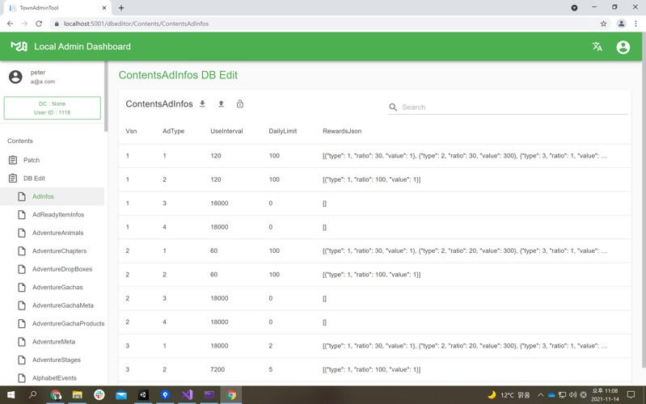

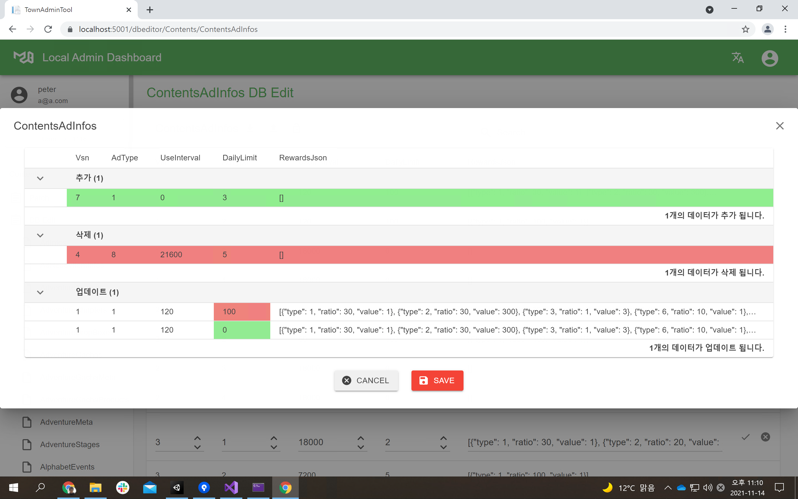

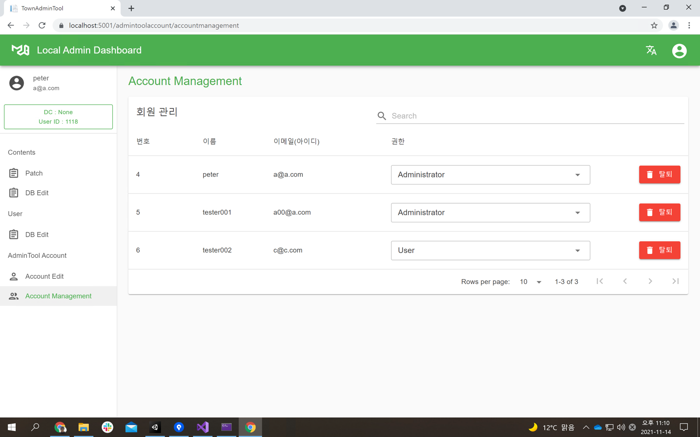

### 1. 기존 어드민 툴의 문제점

기존 어드민 툴은 **DB 서버 데이터를 관리하기 위한 내부 도구**로 운영되고 있었습니다.

- **백엔드**: Node.js 기반(구버전) → `async/await` 미지원, **콜백 방식**으로만 구현되어 코드 가독성이 떨어지고 유지보수가 어려움.
    - _라인 퍼블리싱 프로젝트였으며, Node.js 버전 업그레이드가 어렵다는 피드백을 받음._
- **프론트엔드**: Pug 기반 → **사용 가능한 개발자가 적어 유지보수가 힘든 상태**.
- **UI/UX 문제**: 필요에 따라 임시로 기능이 추가되면서 **비효율적인 UI 구조**가 형성되어 사용성이 떨어지는 문제가 제기됨.

이러한 문제를 해결하기 위해 **새로운 어드민 툴을 개발**하기로 결정했습니다.

### 2. 새로운 어드민 툴 개발 방향

- **C# 기반 .NET 기술 스택 채택**
    
    - 모든 프로그래머가 익숙한 **C#을 사용할 수 있도록 .NET을 선택**.
    - 프론트엔드는 **Blazor**를 활용하여 개발.
- **기획팀의 데이터 관리 방식 개선**
    
    - 기존에는 기획팀이 엑셀에서 데이터를 편집한 후, 이를 **DB 에디터에 직접 붙여넣는 방식**으로 관리.
    - 보안 및 데이터 일관성 문제를 방지하기 위해 **기획팀의 직접적인 DB 접근을 차단**하고, **새로운 어드민 툴을 통해 데이터 관리가 가능하도록 변경**.

### 3. 새로운 어드민 툴의 핵심 기능

#### 엑셀 기반의 데이터 관리 시스템

- 기획팀은 **어드민 툴에서 특정 테이블의 데이터를 엑셀 파일로 다운로드**한 후, 데이터를 편집하여 다시 업로드하면 **DB가 자동 갱신되는 방식**으로 변경.
- **버전 관리 가능**: 엑셀 파일을 활용하여 **이전 데이터와 변경 이력을 관리할 수 있는 장점**이 있음.

#### DB 변경 내역 비교 기능

- 엑셀 데이터를 업로드할 때, 기존 DB와 비교하여 **추가/삭제/업데이트된 항목을 직관적으로 확인할 수 있도록 설계**.

#### 사용자 관리 및 권한 시스템

- **간단한 회원 관리 기능 구현**.
- **사용자 권한에 따라 접근 가능한 기능을 제한**, 보안성을 강화.
