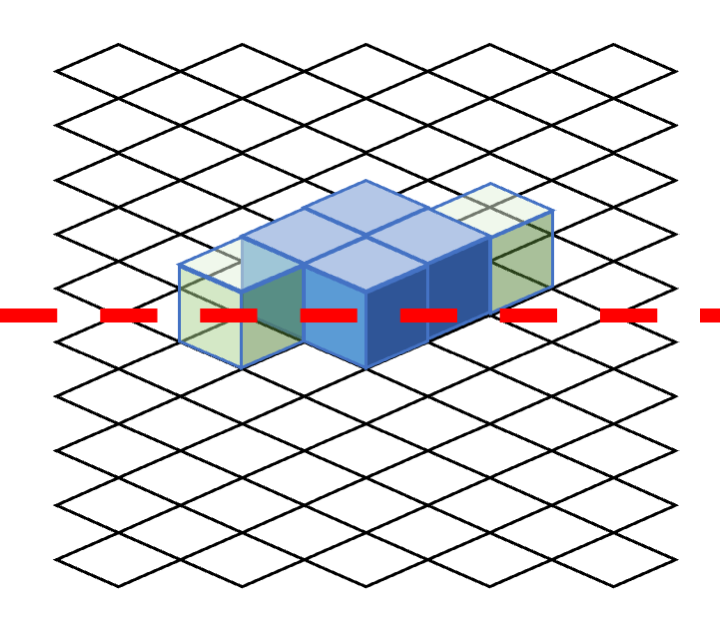
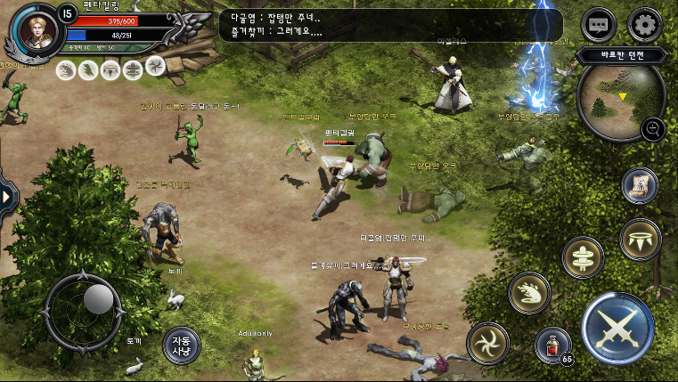

## 개발 기간

- 2016.10 ~ 2017.03 (약 6개월)

---

## 타일맵 시스템

이 프로젝트는 **Unity의 타일맵 패키지가 존재하지 않던 시기**에 진행되었기 때문에, **타일맵 시스템을 직접 제작**하여 구현했습니다.

### **카메라 각도에 따른 타일맵 변환**

- **타일맵 매니저**를 통해 카메라의 각도를 설정하면 **2D 좌표계에 맞춰 화면을 자동 조정**.
- 카메라 시점에 따라 타일맵이 유동적으로 변화하도록 설계됨.

### **오브젝트의 깊이값(Depth) 계산**

- 오브젝트의 **좌우 모서리를 기준으로 앞뒤 판정**을 수행.
- 모든 오브젝트는 **자신의 모서리를 기준으로 깊이 값을 계산하여, 겹침 문제를 해결**.

### **모서리 기준 깊이값 문제**

- **일반적인 정사각형 오브젝트(예: 2x2)는 문제 없음**.
- 하지만 **3x2와 같이 좌우 크기가 다른 오브젝트는 깊이값이 2개 필요**하여, 기존 방식으로는 충돌 판정이 어려움.

### **해결 방법**

- **비정형 오브젝트를 동일한 크기의 타일로 분할**하여 각 부분이 개별적인 깊이값을 가지도록 처리.
- 예를 들어, **3x2 크기의 오브젝트를 1x1 크기의 타일 3개로 분할**하여 각 타일이 독립적으로 깊이 값을 관리하도록 구현.

### **오토 슬라이서 기능 추가**

- **디자이너가 유니티에서 직접 오브젝트를 생성할 수 있도록, 이미지를 넣으면 자동으로 슬라이스하는 툴을 개발**.
- 수작업 없이 **오브젝트를 효율적으로 생성 가능**.

### **최종 결과**

- **캐릭터와 배경 오브젝트가 원하는 방식으로 정렬됨**을 확인.
- **타일맵 시스템을 활용하여 오브젝트 배치 및 정렬을 자동화**.

---

## AStar 알고리즘을 활용한 캐릭터 이동 시스템

- **몬스터 이동**: A* 알고리즘을 이용하여 최적 경로 탐색 후 이동.
- **플레이어 이동**:
    1. **가상 조이스틱**을 이용한 자유 이동 방식.
    2. **화면 터치 시 해당 위치로 이동하는 방식**을 추가 구현.

---

## 전투 시스템 구현

- **기본 전투 시스템 개발**:
    - 플레이어의 **공격 및 피격 처리** 구현.
    - 피격 시 **HP 감소 및 사망 로직 적용**.

---

## 서버 연동 및 멀티플레이 환경 구축

- 서버를 통해 **여러 플레이어가 동시에 접속 가능** 하도록 구현.
- **총 3개 구역 구현**:
    1. **마을** (안전 지역)
    2. **던전** (전투 지역)
    3. **필드 사냥터** (몬스터 서식 지역)

