![[image56.png]]

이 프로젝트는 **모바일 아케이드 게임**으로, 초기에 _판타스틱 히어로_ 라는 이름으로 **원스토어에 출시된 후, 이후 대규모 업데이트를 거쳐 구글 플레이 및 iOS 스토어에 정식 출시**되었습니다.

- **수익 구조**: 광고 및 인앱 결제(IAP)
- **UI 시스템**: NGUI 사용

개발 과정에서 프로젝트의 **중단과 재개가 반복되었지만**, 지속적인 개선을 통해 완성도를 높여 출시되었습니다.

## 개발 기간

- 2015 ~ 2016 (약 8개월 / 다른 프로젝트의 병행으로 중간중간 중단과 진행을 반복)

---

## 플레이 방식

- **터치 & 홀드**: 터치를 유지하면 **막대기가 늘어나고**, 터치를 떼면 **막대기가 쓰러지며 다리 역할을 함**.
- **목표**: 현재 위치에서 **다음 지점까지의 거리를 정확하게 맞춰야 이동 가능**.

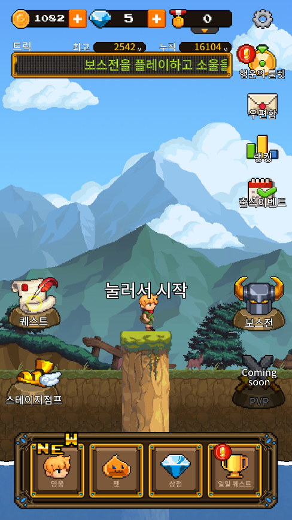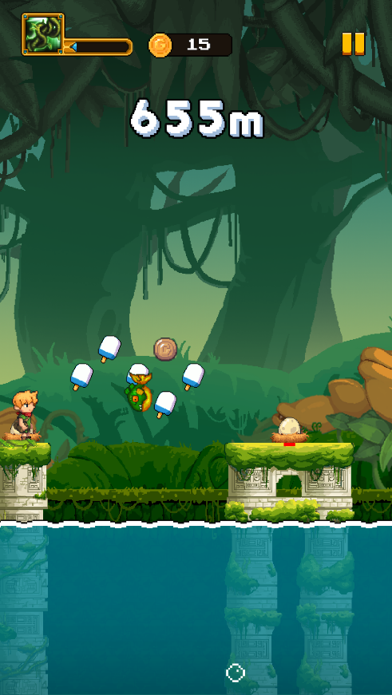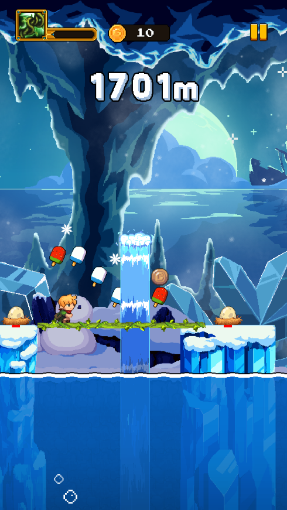

---

## 주요 시스템

### **1. 다양한 캐릭터 및 코스튬, 펫 시스템**

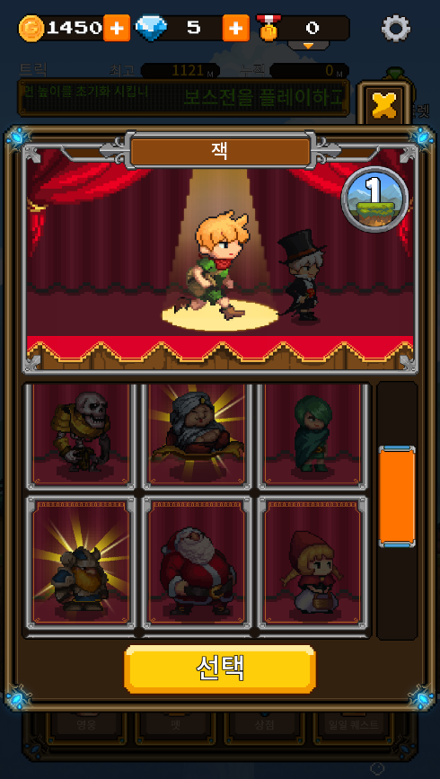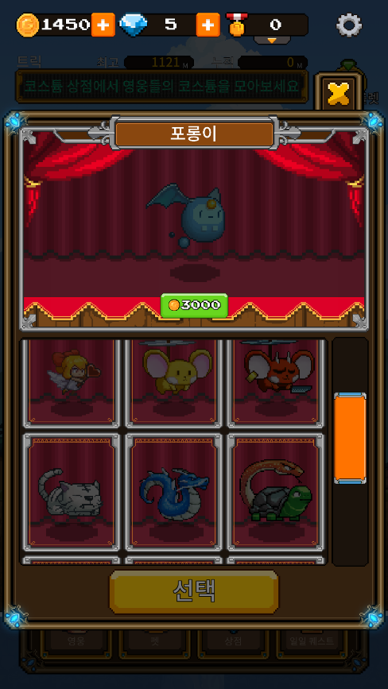

- 각 캐릭터는 **고유한 스킬**을 보유.
- **코스튬 장착 시 추가 능력치 제공**.
- **펫 시스템 도입**: 하나의 펫을 동행할 수 있으며, 각 펫은 고유한 능력을 보유.

### **2. 서버 기반 콘텐츠**

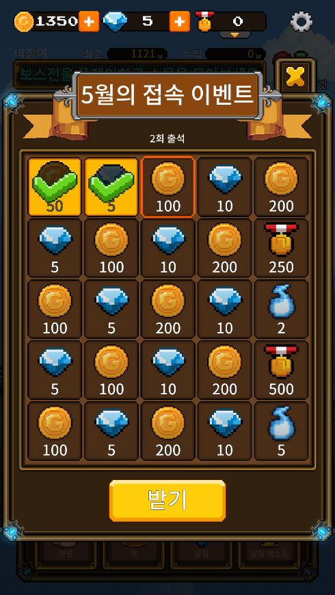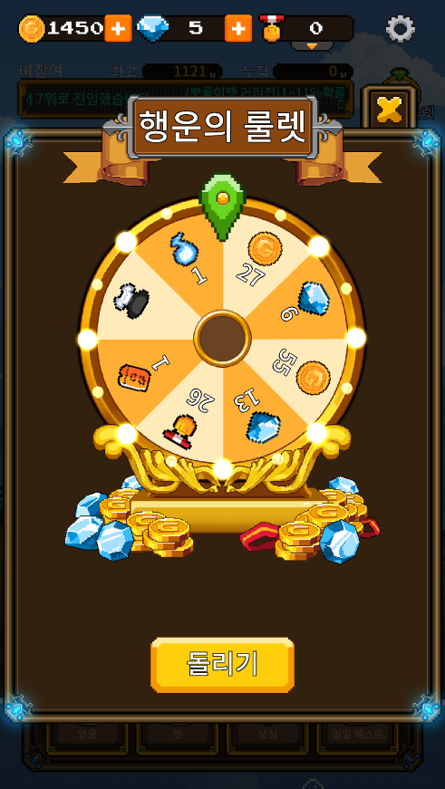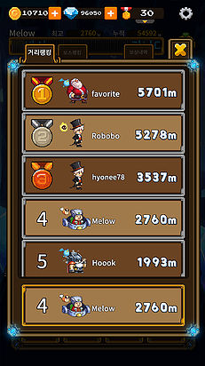

- **룰렛, 출석 체크, 랭킹, 랭킹 보상 등 서버 연동 콘텐츠 제공**.
- 서버 프로그래머가 제공한 API를 활용하여 **출석 체크, 우편함, 룰렛, 랭킹 시스템 구현**.

### **3. 보스전 모드**

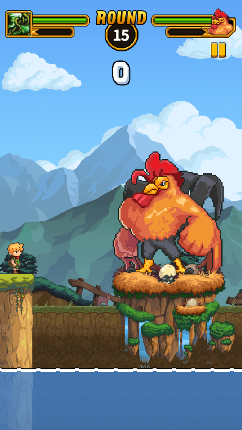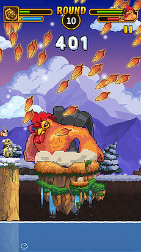

- **일반 스테이지와 차별화된 플레이 방식**을 제공.
- 막대기를 이용해 보스를 공격하여 쓰러뜨리는 방식의 전투.
- **매일 일정 횟수의 입장권 지급**, 정해진 횟수 내에서 **최대한 높은 점수를 기록하는 경쟁 콘텐츠**.
- **입장 횟수 및 점수 기록이 서버와 연동되어 관리됨**.

### **4. 퀘스트 시스템**

- 다양한 목표를 수행하여 보상을 획득하는 퀘스트 기능 포함.

### **5. 스테이지 진행 방식**

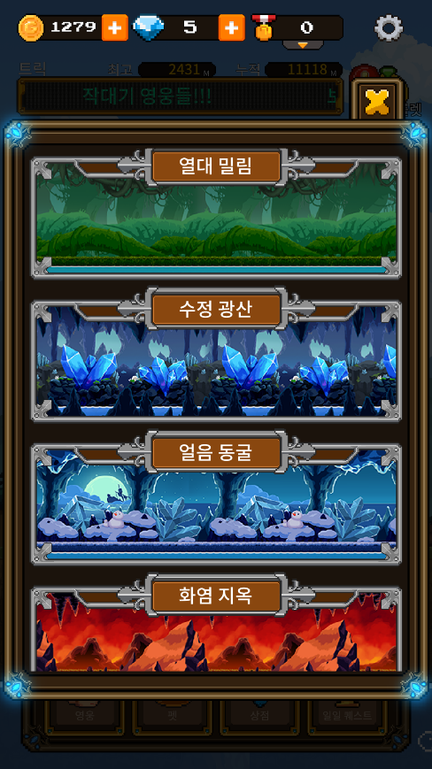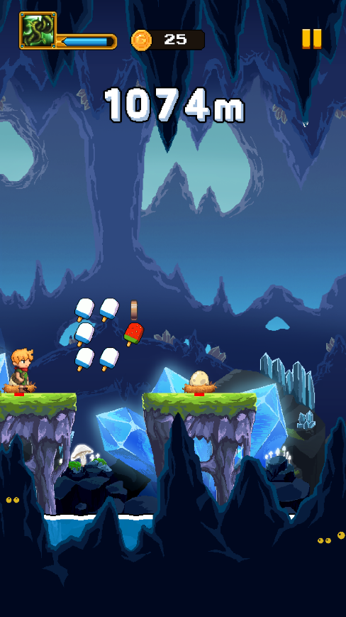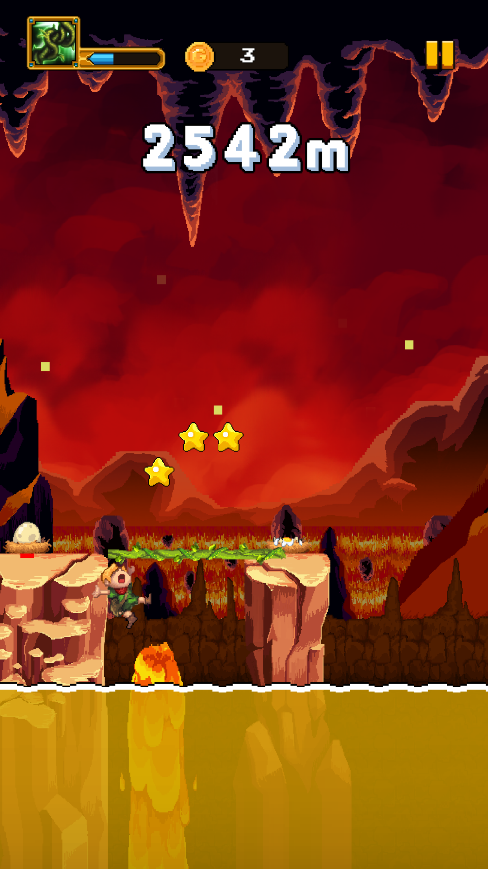

- **기록에 따라 스테이지가 변경**되는 방식.
- 한 번 클리어한 스테이지는 **재화를 사용하여 즉시 이동(점프) 가능**.
