이 프로젝트는 **모바일 플랫폼**에서 서비스되는 **슬라이딩 퍼즐과 미로가 결합된 퍼즐 게임**입니다.

- **150개 이상의 스테이지**와 다양한 퍼즐 장치가 포함되어 있음.
- 스테이지별로 **새로운 퍼즐 요소가 등장**하여 플레이어에게 점진적인 난이도 상승을 제공.

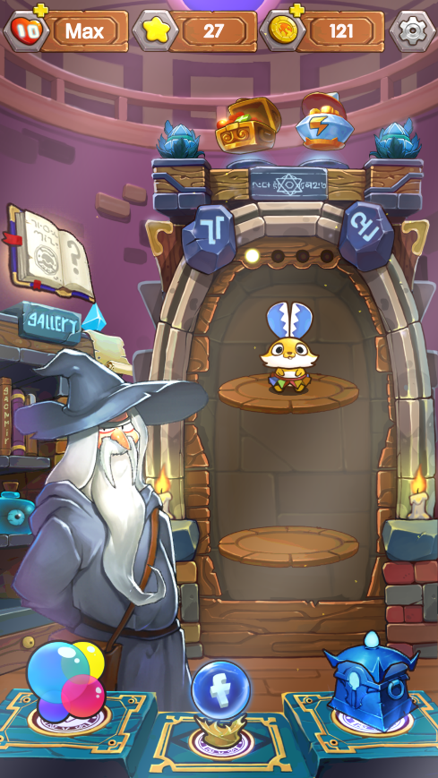

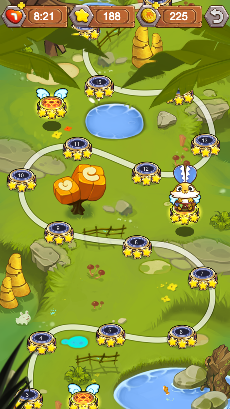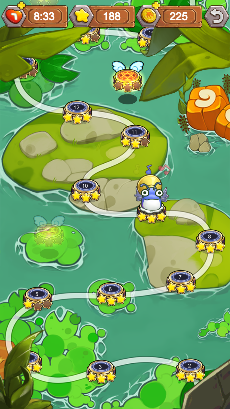

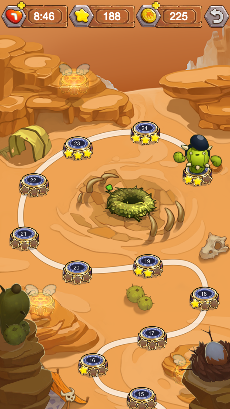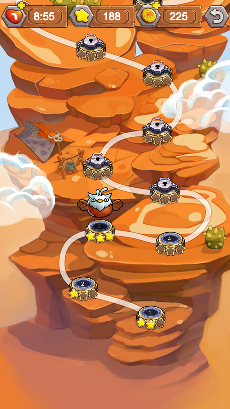

## 개발 기간

- 2015 ~ 2016 (약 10개월)

---

## 퍼즐 제작 툴 개발

- 유니티에서 **퍼즐을 쉽고 빠르게 제작 및 테스트할 수 있도록 전용 툴을 개발**.
- 개발자가 보다 **효율적으로 퍼즐을 설계하고 즉시 테스트할 수 있는 환경 제공**.

---

## 퍼즐 디자인

- **모든 퍼즐 디자인을 직접 담당**.
- 총 **210개 이상의 퍼즐을 제작**, 이 중 **약 60개는 업데이트되지 못함**.
- 퍼즐의 난이도를 체계적으로 설계하여 **단계별 도전 욕구를 극대화**.

---

## 다양한 스테이지 구성

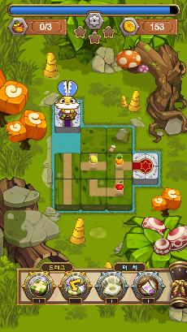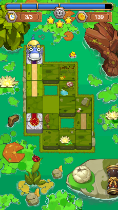

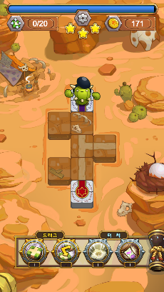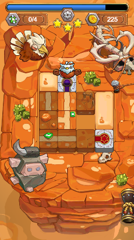

- 게임에는 **다양한 퍼즐 장치가 포함된 여러 개의 스테이지가 존재**.
- 스테이지 유형:
    - **일반 스테이지**: 25개
    - **보너스 스테이지**: 5개

---

## 별 시스템

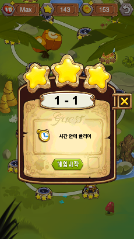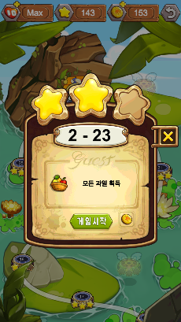

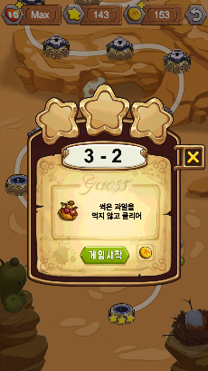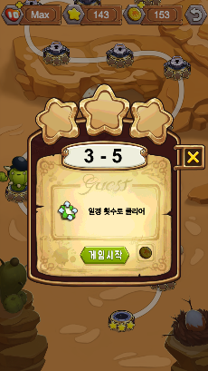

- 각 퍼즐에는 **특정 조건을 만족하면 획득할 수 있는 별 시스템이 적용**.
- 모든 퍼즐은 **최대 3개의 별을 획득하는 방식으로 디자인**됨.
- 별의 용도:
    - **순위 경쟁 요소** 추가.
    - **다음 스테이지를 해금하는 데 사용**.

---

## 보너스 스테이지

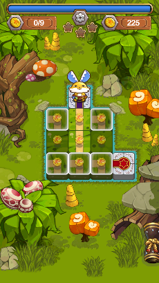

- 일반 스테이지와는 **다른 방식의 특별한 퍼즐 스테이지** 제공.
- 기존 규칙에서 벗어나 **새로운 퍼즐 경험을 제공**하여 게임의 다양성 강화.

---

## 구글 플레이 및 게임센터 연동

- **구글 플레이 및 게임센터 플러그인을 활용하여 랭킹 시스템 구현**.
- 플레이어가 **자신의 기록을 공유하고 경쟁할 수 있도록 연동**.

---

## 다국어 지원 시스템 개발

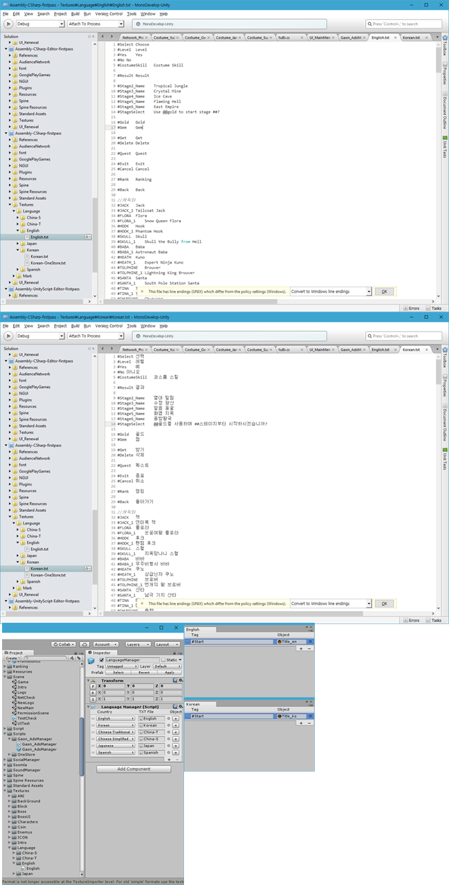

기존에는 **프로그래머가 코드 영역에서 직접 텍스트를 관리**해야 했으나,  
텍스트 양이 많아지면서 관리의 어려움이 발생.  
이를 해결하기 위해 **기획자가 보다 쉽게 다국어를 관리할 수 있도록 새로운 시스템을 개발**.

### **개발 목적**

- **효율적인 다국어 관리 환경 구축**.
- **업무 분담 최적화**: 기획자가 직접 텍스트를 관리할 수 있도록 개선.
- **새로운 언어 추가 시 프로그래밍 수정이 필요 없는 구조** 설계.

### **주요 기능**

1. **태그값을 이용한 텍스트 호출** (프로그래밍 없이 다국어 적용 가능).
2. **리소스(이미지, 사운드 등)도 태그값을 활용하여 호출 가능**.
3. **엑셀을 이용한 데이터 관리 → TXT 변환하여 사용** (편리한 버전 관리).
4. **국가 제한 없이 새로운 언어 추가 가능** (추가적인 프로그래밍 작업 불필요).
5. **기기의 기본 언어를 자동 탐지하여 기본 언어로 설정** (사용자가 변경 가능).

### **다국어 시스템이 적용된 프로젝트**

- [허니 프렌즈](./04_honey_friends)
- [작대기 영웅들](./05_stick_heroes)
- [슬라이딩퍼즐 어드벤처](./06_sliding_puzzle_adventure)
