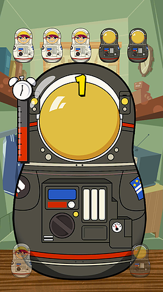
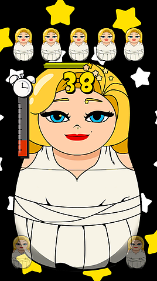
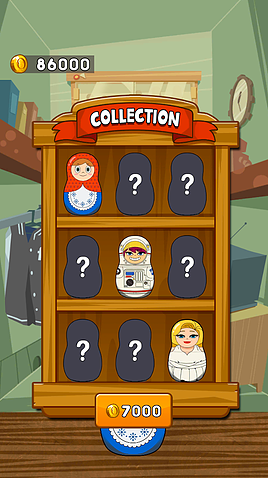
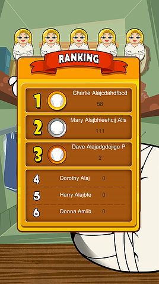

## 개발 기간

- 2015.10 ~ 2016.01 (약 3개월)

---

## 플레이 방식

- **두 가지 형태의 마트료시카 인형이 상단에 순차적으로 표시됨**.
- 플레이어는 **하단의 버튼을 터치하여 해당 인형과 동일한 버튼을 빠르고 정확하게 눌러야 함**.
- **제한 시간 내에 최대한 높은 점수를 획득하는 것이 목표**.
- **피버 타임(Fever Time)**:
    - 일정 점수 이상 도달 시 **한 가지 인형만 등장**하여 보다 빠르게 점수를 올릴 수 있음.

---

## 컬렉션 시스템

- 다양한 **수집 가능한 아이템 존재**.
- 높은 점수를 기록하여 **모든 수집품을 모으는 것이 목표**.

---

## 랭킹 시스템

- **구글 플레이 및 게임센터 연동**.
- **랭킹 시스템을 통해 플레이어 간 경쟁 가능**.
