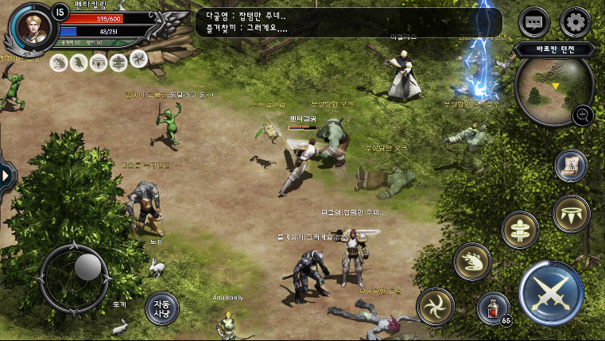
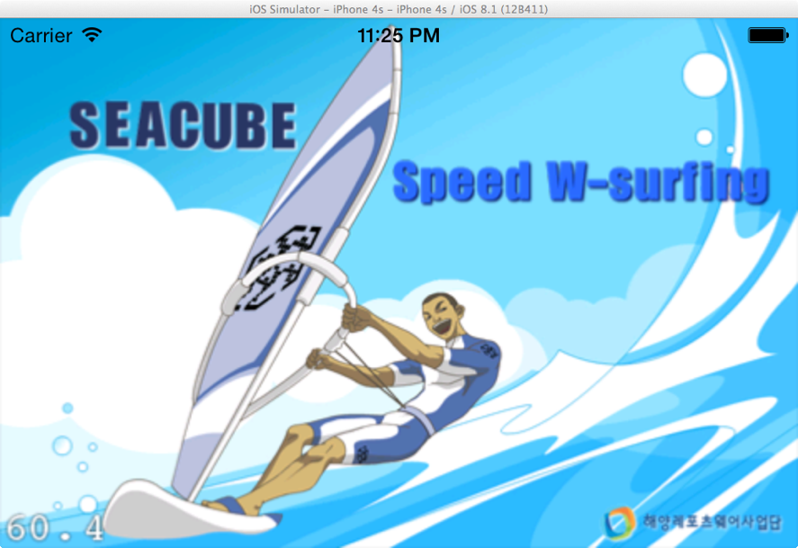

---
# Feel free to add content and custom Front Matter to this file.
# To modify the layout, see https://jekyllrb.com/docs/themes/#overriding-theme-defaults

layout: default
title: 포트폴리오
description: 소개글

---

## 소개

- 이름 : 이창현
- 이메일 : trickbreak@naver.com
- 블로그 : [https://trickbreak.github.io/](https://trickbreak.github.io/)

게임 개발자로서 다양한 프로젝트를 경험하며, Unity와 C#을 주력으로 게임 개발을 진행하고 있습니다. 개발 과정에서 발생하는 이슈를 해결하며 배우는 것을 즐기며, 이를 기록하고 공유하기 위해 기술 [블로그](https://trickbreak.github.io/)를 운영하고 있습니다.

---

## 기술 및 역량

- 프로그래밍 언어 : C#, C++, C, Python, Objective-C, Java
- 게임엔진 : Unity, Cocos2d
- Unity Custom Editor 를 이용한 Unity Tool 개발
- CI/CD : Jenkins, GitHub Actions
- aos, ios 네이티브 유니티 플러그인 제작 (알림, 햅틱 진동 처리 등)
- Docker, Git, .Net Blazor

---

## 주요 프로젝트

프로젝트는 시간순으로 정렬되어 있습니다. (1번이 가장 최근에 진행한 프로젝트 입니다.)

### 1. 머지 서바이벌

<iframe width="560" height="315" src="https://www.youtube.com/embed/QhQPK9Aj7lI?si=JjVzvpPW1ogAePSn" title="YouTube video player" frameborder="0" allow="accelerometer; autoplay; clipboard-write; encrypted-media; gyroscope; picture-in-picture; web-share" referrerpolicy="strict-origin-when-cross-origin" allowfullscreen></iframe>

- 소속 : 스티키핸즈
- 출시 여부 : AOS / IOS 글로벌 출시
- 사용 엔진 : Unity
- 담당 파트
	- 인게임 퍼즐 제작
	- 아웃게임 월드 제작
- [**상세 페이지**](./01_merge_survival)

---

### 2. 포코팡 타운

<iframe width="560" height="315" src="https://www.youtube.com/embed/3C4teTSvbkU?si=rBKJn711FODT9IXD" title="YouTube video player" frameborder="0" allow="accelerometer; autoplay; clipboard-write; encrypted-media; gyroscope; picture-in-picture; web-share" referrerpolicy="strict-origin-when-cross-origin" allowfullscreen></iframe>

- 소속 : 트리노드
- 출시 여부 : IOS / AOS 일본 서비스중
- 사용 엔진 : Unity
- 담당 파트 : 클라이언트 (3년) / 서버 (6개월)
	- 인 / 아웃게임 컨텐츠 제작
	- 광고 및 각종 플러그인 관리
	- 유니티 버전 관리
	- CI / CD (빌드 및 배포) 툴 관리
	- 서버 컨텐츠 작업
	- 어드민툴 개선
- [**상세 페이지**](./02_pokopang_town)

---

### 3. 대륙의 지배자

- 소속 : 가온미르
- 출시 여부 : 미출시
- 사용 엔진 : Unity
- 개발 기간 : 약 6개월 (2016.10 ~ 2017.03)
- 담당 파트
	- 아이솔레이트 맵 제작 시스템
	- AStar 알고리즘을 이용한 캐릭터 이동 처리
	- 전투 시스템
- [**상세 페이지**](./03_the_lord_of_the_continent)

---

### 4. 허니 프렌즈

<iframe width="560" height="315" src="https://www.youtube.com/embed/GcfmlgWrMMc?si=9EBSSbn_ecbwi9e2" title="YouTube video player" frameborder="0" allow="accelerometer; autoplay; clipboard-write; encrypted-media; gyroscope; picture-in-picture; web-share" referrerpolicy="strict-origin-when-cross-origin" allowfullscreen></iframe>

- 소속 : 가온미르
- 출시 여부 : IOS, AOS 글로벌 출시
- 사용 엔진 : Unity
- 개발 기간 : 약 4개월 (2016.11 ~ 2017.02)
- 담당 파트
	- 퍼즐 제작 툴
	- 다국어 지원 시스템
	- 다양한 해상도 대응 작업
- [**상세 페이지**](./04_honey_friends)

---

### 5. 작대기 영웅들

<iframe width="560" height="315" src="https://www.youtube.com/embed/dW0MDLJveYw?si=2NH5iwnI1kC02cdZ" title="YouTube video player" frameborder="0" allow="accelerometer; autoplay; clipboard-write; encrypted-media; gyroscope; picture-in-picture; web-share" referrerpolicy="strict-origin-when-cross-origin" allowfullscreen></iframe>

- 소속 : 가온미르
- 출시 여부 : IOS, AOS 글로벌 출시
- 사용 엔진 : Unity
- 개발 기간 : 약 8개월 (2015 ~ 2016)
- 담당 파트
	- 인게임 제작
	- 보스전 제작
	- 광고 및 인앱 그리고 외부 플러그인 (google Analytics 등) 추가
- [**상세 페이지**](./05_stick_heroes)

---

### 6. 슬라이딩퍼즐:어드벤처

<iframe width="560" height="315" src="https://www.youtube.com/embed/TyCi0J7fTpQ?si=0KAOLsylQ86fy8UX" title="YouTube video player" frameborder="0" allow="accelerometer; autoplay; clipboard-write; encrypted-media; gyroscope; picture-in-picture; web-share" referrerpolicy="strict-origin-when-cross-origin" allowfullscreen></iframe>

- 소속 : 가온미르
- 출시 여부 : AOS / IOS 글로벌 출시
- 사용 엔진 : Unity
- 개발 기간 : 약 10개월 (2015 ~ 2016)
- 담당 파트
	- 퍼즐 레벨 디자인
	- 퍼즐 제작 툴 제작
	- 다국어 지원 툴 제작
	- 광고 및 인앱 그리고 외부 플러그인 (google Analytics 등) 추가
- [**상세 페이지**](./06_sliding_puzzle_adventure)

---

### 7. 까요까요

- 소속 : 가온미르
- 출시 여부 : 미출시
- 사용 엔진 : Unity
- 개발 기간 : 약 3개월 (2015. 10 ~ 2016. 1)
- 담당 파트
	- 모든 클라이언트 파트
	- 광고 연동
	- 에브리플레이 플러그인연동(플레이 영상을 찍고 공유할 수 있는 플러그인)
- [**상세 페이지**](./07_kkayo_kkayo)

---

### 8. SEACUBE W-Surfing

- 출시 여부 : IOS 국내 출시
- 사용 엔진 : cocos2d
- 개발 기간 : 약 3주 (2014)
- 담당 파트 : 리소스 및 기획만 제공 받고 모든 프로그래밍 파트 개발
- 기타
	- 부산의 **모바일로** 라는 회사를 통해 외주 개발 진행
	- 윈드서핑을 주제로 한 해양 스포츠 게임
- [**상세 페이지**](./08_seacube_w_surfing)
